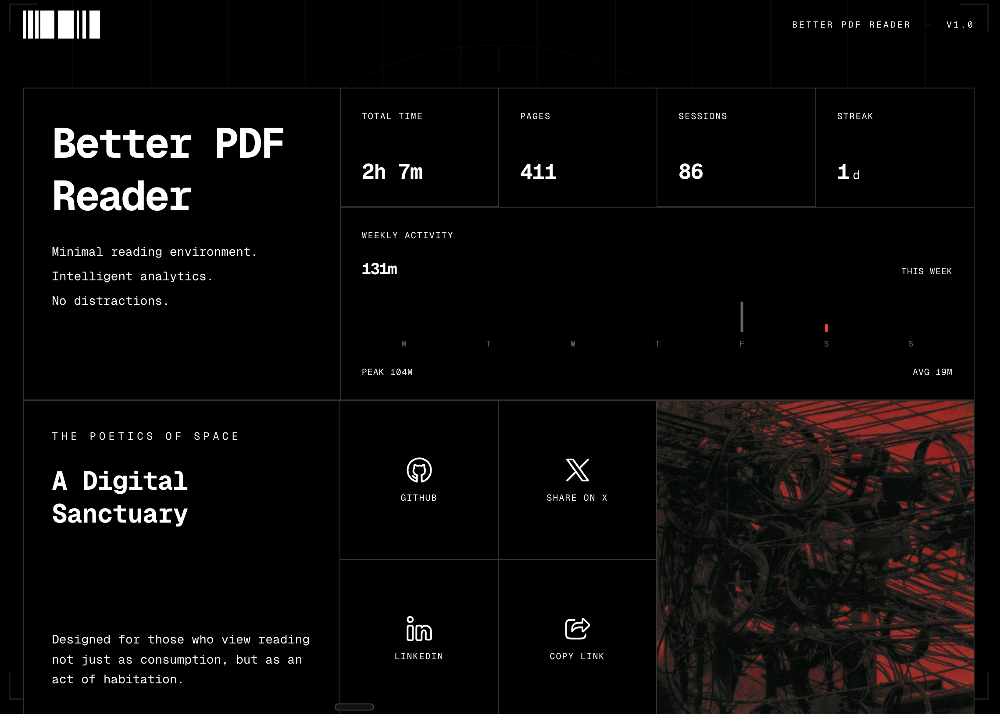
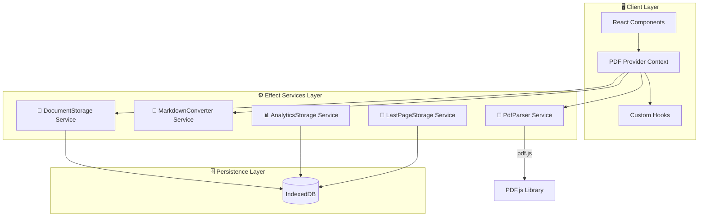
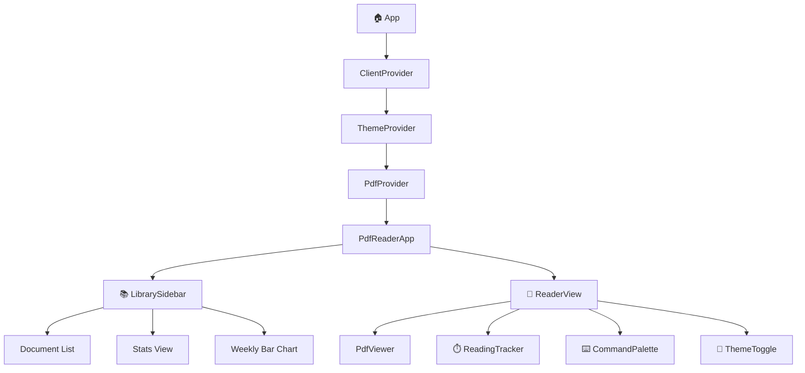
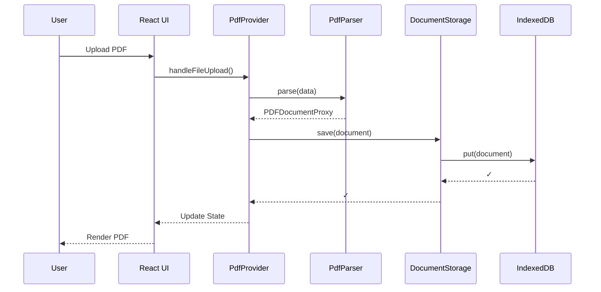
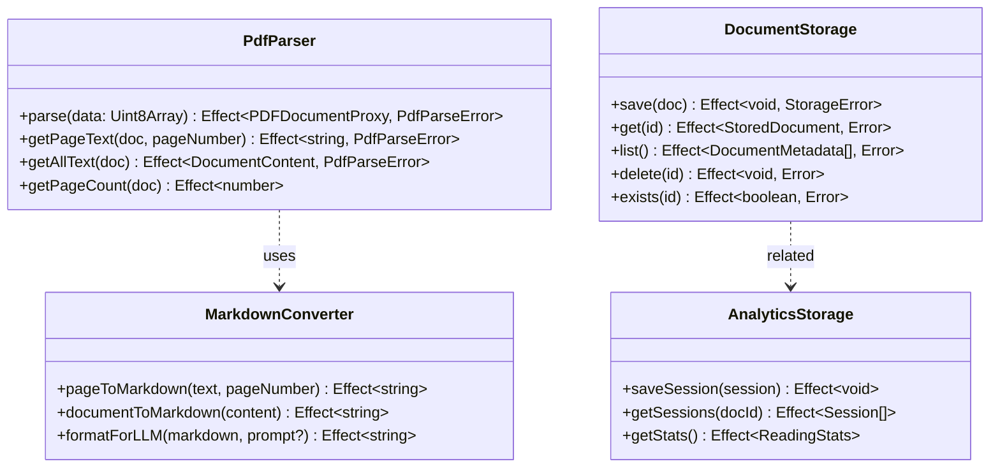

<p align="center">
  
</p>

<h1 align="center">BETTER PDF READER</h1>

<p align="center">
  <strong>v1.0</strong> — The PDF reader that should have existed. Built for speed, designed for focus.
</p>

<p align="center">
  <a href="https://better-pdf-reader.vercel.app/">🚀 Live Demo</a> •
  <a href="https://github.com/kiritocode1/better-pdf-reader">📦 Source Code</a>
</p>

<p align="center">
  
</p>

---

## ✨ Why Better PDF Reader?

> **ISTG in 2026, why were there no good PDF reader clients?**  
> Why is no one rethinking how people interact with PDFs?

My partner was having the same problems with reading PDFs. Clunky interfaces, slow rendering, no keyboard shortcuts, and zero AI integration. So I built the PDF reader I always wanted.

**Enterprise ready and designed to conquer your learning curriculum.**

---

## 🎯 Features

| Feature | Shortcut | Description |
|---------|----------|-------------|
| **Command Palette** | `⌘ + K` | Quick access to all actions |
| **Reading Timer** | `⌘ + I` | Track your reading sessions |
| **AI-Friendly Copy** | — | Copy page content as Markdown for LLM prompts |
| **OLAP Analytics** | — | Reading habits tracking & visualization |
| **Local-First** | — | Powered by IndexedDB, your data stays with you |
| **Beautiful UI** | — | Nothing OS inspired, dark/light themes |

---

## 🏗️ Architecture

Better PDF Reader is built with a clean, Effect-based architecture that ensures type-safety, composability, and excellent developer experience.

### System Overview



### Component Hierarchy



### Data Flow



### Effect Service Layer



---

## 🛠️ Tech Stack

| Category | Technology |
|----------|------------|
| **Runtime** | [Bun](https://bun.sh) |
| **Framework** | [Next.js 16](https://nextjs.org) |
| **Functional Core** | [Effect](https://effect.website) |
| **PDF Rendering** | [PDF.js](https://mozilla.github.io/pdf.js/) |
| **Styling** | [Tailwind CSS v4](https://tailwindcss.com) |
| **Animations** | [Framer Motion](https://www.framer.com/motion/) |
| **Charts** | [Recharts](https://recharts.org) |
| **Storage** | [IndexedDB](https://developer.mozilla.org/en-US/docs/Web/API/IndexedDB_API) via [idb](https://github.com/jakearchibald/idb) |
| **UI Components** | [Base UI](https://base-ui.com) |
| **Icons** | [Hugeicons](https://hugeicons.com) |
| **Hosting** | [Vercel](https://vercel.com) |

---

## 🚀 Quick Start

```bash
# Clone the repository
git clone https://github.com/kiritocode1/better-pdf-reader.git
cd better-pdf-reader

# Install dependencies (uses bun)
bun install

# Start development server
bun run dev

# Build for production
bun run build
```

---

## 📁 Project Structure

```
better-pdf/
├── src/
│   ├── app/                    # Next.js app router
│   │   ├── icon.svg           # App icon
│   │   ├── layout.tsx         # Root layout
│   │   └── page.tsx           # Main page
│   ├── components/
│   │   ├── providers/         # Context providers
│   │   │   ├── pdf-provider.tsx
│   │   │   └── client-provider.tsx
│   │   ├── ui/                # Base UI components
│   │   ├── pdf-viewer.tsx     # PDF rendering component
│   │   ├── reader-view.tsx    # Main reader interface
│   │   ├── library-sidebar.tsx
│   │   ├── command-palette.tsx
│   │   ├── reading-tracker.tsx
│   │   └── weekly-bar-chart.tsx
│   ├── lib/
│   │   ├── pdf-services.ts    # Effect-based PDF services
│   │   ├── storage.ts         # Document storage service
│   │   ├── analytics-storage.ts
│   │   └── last-page-storage.ts
│   ├── hooks/
│   └── styles/
├── public/
├── hero.png
├── package.json
└── README.md
```

---

## 🔧 Key Concepts

### Effect-Based Services

All core logic uses [Effect](https://effect.website) for:
- **Type-safe error handling** — No more `try/catch` scattered everywhere
- **Composable services** — Layer-based dependency injection
- **Traceable functions** — Built-in observability with `Effect.fn`

```typescript
// Example: PDF Parser Service
export class PdfParser extends Context.Tag("@app/PdfParser")<
  PdfParser,
  {
    readonly parse: (data: Uint8Array) => Effect.Effect<PDFDocumentProxy, PdfParseError>;
    readonly getPageText: (doc: PDFDocumentProxy, pageNumber: number) => Effect.Effect<string, PdfParseError>;
  }
>() {
  static readonly layer = Layer.succeed(PdfParser, PdfParser.of({
    parse: Effect.fn("PdfParser.parse")(function* (data) {
      const pdfjsLib = yield* getPdfjs();
      return yield* Effect.tryPromise({
        try: () => pdfjsLib.getDocument({ data }).promise,
        catch: (error) => new PdfParseError({ message: "Failed to parse PDF", cause: error }),
      });
    }),
    // ...
  }));
}
```

### Local-First Architecture

Your documents never leave your device:
- **IndexedDB** stores all PDFs, reading progress, and analytics
- **No server uploads** — complete privacy
- **Works offline** — once loaded, everything works

---

## 📊 Reading Analytics

Track your reading habits with built-in OLAP analytics:

- 📈 Pages read per session
- ⏱️ Time spent reading
- 📅 Weekly activity charts
- 🎯 Reading speed metrics

---

## 🎨 Design Philosophy

Inspired by **Nothing OS** — minimalist, functional, and beautiful.

- Clean typography with proper hierarchy
- Smooth micro-animations via Framer Motion
- Dark/light theme with system preference detection
- Keyboard-first interaction design

---

## 🤝 Contributing

Contributions are welcome! Feel free to:

1. Fork the repository
2. Create a feature branch (`git checkout -b feature/amazing-feature`)
3. Commit your changes (`git commit -m 'Add amazing feature'`)
4. Push to the branch (`git push origin feature/amazing-feature`)
5. Open a Pull Request

---

## 📄 License

Free and Open Source — **MIT License**

---

<p align="center">
  <strong>Made with Effect, Bun, and Next.js</strong>
</p>

<p align="center">
  It's fast because it uses Effect and is hosted on Vercel ⚡
</p>

<p align="center">
  <a href="https://github.com/kiritocode1/better-pdf-reader">⭐ Star on GitHub 🖤</a>
</p>

<p align="center">
  <code>#MAKESOFTWAREFUNAGAIN</code> <code>#EFFECTS</code>
</p>
